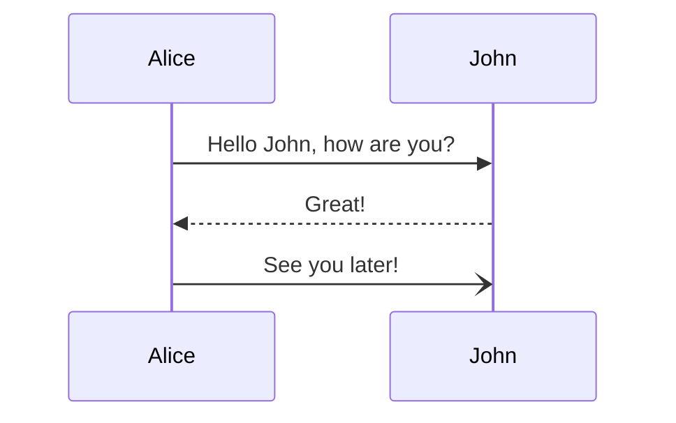

I want to test jupyter notebook as a notes and presentation tool. Emphasis is on the tech team and especially solution designs.


```typescript
import { DOMParser } from "https://deno.land/x/deno_dom/deno-dom-wasm.ts";
import React from "https://esm.sh/react";
import ReactDOMServer from "https://esm.sh/react-dom/server";

const document = new DOMParser().parseFromString("<!DOCTYPE html><html><body></body></html>", "text/html");
const container = document.createElement("div");

function App() {
    return (
        <div style={{ textAlign: "center", fontFamily: "Arial, sans-serif" }}>
            <h1 style={{ color: "blue" }}>Hello, Styled React in Jupyter!</h1>
            <p style={{ fontSize: "18px" }}>This is a paragraph styled with inline CSS.</p>
        </div>
    );
}

const renderedHTML = ReactDOMServer.renderToString(<App />);

// Inject HTML directly into the output area using customElements
// Simulate DOM for server-side rendering
container.innerHTML = renderedHTML;
document.body.appendChild(container);
```


<div><div style="text-align:center;font-family:Arial, sans-serif"><h1 style="color:blue">Hello, Styled React in Jupyter!</h1><p style="font-size:18px">This is a paragraph styled with inline CSS.</p></div></div>


```typescript
import { DOMParser } from "https://deno.land/x/deno_dom/deno-dom-wasm.ts";
import React from "https://esm.sh/react";
import ReactDOMServer from "https://esm.sh/react-dom/server";

// Simulate a DOM
const document = new DOMParser().parseFromString("<!DOCTYPE html><html><body></body></html>", "text/html");
const container = document.createElement("div");

// Define React component with inline styles
function App() {
    return (
        <div style={{ margin: "20px", textAlign: "center", fontFamily: "Arial, sans-serif" }}>
            <h1 style={{ color: "#1976d2", fontSize: "2rem", marginBottom: "20px" }}>Contact Us</h1>
            <form style={{ display: "inline-block", textAlign: "left", width: "300px" }}>
                <div style={{ marginBottom: "15px" }}>
                    <label style={{ display: "block", fontWeight: "bold", marginBottom: "5px" }}>
                        Name
                    </label>
                    <input
                        type="text"
                        style={{
                            width: "100%",
                            padding: "10px",
                            fontSize: "16px",
                            border: "1px solid #ccc",
                            borderRadius: "4px",
                        }}
                    />
                </div>
                <div style={{ marginBottom: "15px" }}>
                    <label style={{ display: "block", fontWeight: "bold", marginBottom: "5px" }}>
                        Email
                    </label>
                    <input
                        type="email"
                        style={{
                            width: "100%",
                            padding: "10px",
                            fontSize: "16px",
                            border: "1px solid #ccc",
                            borderRadius: "4px",
                        }}
                    />
                </div>
                <div style={{ marginBottom: "15px" }}>
                    <label style={{ display: "block", fontWeight: "bold", marginBottom: "5px" }}>
                        Message
                    </label>
                    <textarea
                        rows={4}
                        style={{
                            width: "100%",
                            padding: "10px",
                            fontSize: "16px",
                            border: "1px solid #ccc",
                            borderRadius: "4px",
                        }}
                    ></textarea>
                </div>
                <button
                    type="submit"
                    style={{
                        width: "100%",
                        padding: "10px",
                        fontSize: "16px",
                        backgroundColor: "#1976d2",
                        color: "white",
                        border: "none",
                        borderRadius: "4px",
                        cursor: "pointer",
                    }}
                >
                    Submit
                </button>
            </form>
        </div>
    );
}

// Render the React component
const renderedHTML = ReactDOMServer.renderToString(<App />);

// Insert the rendered React HTML into the container
container.innerHTML = renderedHTML;

document.body.appendChild(container);
```


<div><div style="margin:20px;text-align:center;font-family:Arial, sans-serif"><h1 style="color:#1976d2;font-size:2rem;margin-bottom:20px">Contact Us</h1><form style="display:inline-block;text-align:left;width:300px"><div style="margin-bottom:15px"><label style="display:block;font-weight:bold;margin-bottom:5px">Name</label><input type="text" style="width:100%;padding:10px;font-size:16px;border:1px solid #ccc;border-radius:4px"></div><div style="margin-bottom:15px"><label style="display:block;font-weight:bold;margin-bottom:5px">Email</label><input type="email" style="width:100%;padding:10px;font-size:16px;border:1px solid #ccc;border-radius:4px"></div><div style="margin-bottom:15px"><label style="display:block;font-weight:bold;margin-bottom:5px">Message</label><textarea rows="4" style="width:100%;padding:10px;font-size:16px;border:1px solid #ccc;border-radius:4px"></textarea></div><button type="submit" style="width:100%;padding:10px;font-size:16px;background-color:#1976d2;color:white;border:none;border-radius:4px;cursor:pointer">Submit</button></form></div></div>


```typescript
import { DOMParser } from "https://deno.land/x/deno_dom/deno-dom-wasm.ts";
import React from "https://esm.sh/react";
import ReactDOMServer from "https://esm.sh/react-dom/server";

// Simulate a DOM
const document = new DOMParser().parseFromString("<!DOCTYPE html><html><body></body></html>", "text/html");
const container = document.createElement("div");

// Fetch Material Design Lite CSS
async function fetchMaterialDesignCSS() {
    const response = await fetch("https://cdnjs.cloudflare.com/ajax/libs/material-design-lite/1.3.0/material.indigo-pink.min.css");
    const css = await response.text();

    // Create a <style> tag and append it to the simulated DOM
    const styleTag = document.createElement("style");
    styleTag.textContent = css;
    return styleTag;
}

// Define a React component
function App() {
    return (
        <div className="mdl-layout mdl-js-layout mdl-layout--fixed-header">
            <main className="mdl-layout__content">
                <div style={{ margin: "20px", textAlign: "center", fontFamily: "Arial, sans-serif" }}>
                    <h1 className="mdl-typography--display-2">Contact Us</h1>
                    <form style={{ display: "inline-block", textAlign: "left", width: "300px" }}>
                        <div className="mdl-textfield mdl-js-textfield" style={{ marginBottom: "15px" }}>
                            <input className="mdl-textfield__input" type="text" id="name" />
                            <label className="mdl-textfield__label" htmlFor="name">Name</label>
                        </div>
                        <div className="mdl-textfield mdl-js-textfield" style={{ marginBottom: "15px" }}>
                            <input className="mdl-textfield__input" type="email" id="email" />
                            <label className="mdl-textfield__label" htmlFor="email">Email</label>
                        </div>
                        <button
                            className="mdl-button mdl-js-button mdl-button--raised mdl-button--colored"
                            style={{ width: "100%" }}
                        >
                            Submit
                        </button>
                    </form>
                </div>
            </main>
        </div>
    );
}

// Render the React component
const renderedHTML = ReactDOMServer.renderToString(<App />);

// Insert the rendered React HTML into the container
container.innerHTML = renderedHTML;

// Fetch and embed the Material Design Lite CSS
const styleTag = await fetchMaterialDesignCSS();
document.head.appendChild(styleTag);

document.body.appendChild(container);
```


<div><div class="mdl-layout mdl-js-layout mdl-layout--fixed-header"><main class="mdl-layout__content"><div style="margin:20px;text-align:center;font-family:Arial, sans-serif"><h1 class="mdl-typography--display-2">Contact Us</h1><form style="display:inline-block;text-align:left;width:300px"><div class="mdl-textfield mdl-js-textfield" style="margin-bottom:15px"><input class="mdl-textfield__input" type="text" id="name"><label class="mdl-textfield__label" for="name">Name</label></div><div class="mdl-textfield mdl-js-textfield" style="margin-bottom:15px"><input class="mdl-textfield__input" type="email" id="email"><label class="mdl-textfield__label" for="email">Email</label></div><button class="mdl-button mdl-js-button mdl-button--raised mdl-button--colored" style="width:100%">Submit</button></form></div></main></div></div>


## Test with svg


<svg width="500" height="500" xmlns="http://www.w3.org/2000/svg">
<foreignObject width="500" height="500">
   <div><div style="margin:20px;text-align:center;font-family:Arial, sans-serif"><h1 style="color:#1976d2;font-size:2rem;margin-bottom:20px">Contact Us</h1><form style="display:inline-block;text-align:left;width:300px"><div style="margin-bottom:15px"><label style="display:block;font-weight:bold;margin-bottom:5px">Name</label><input type="text" style="width:100%;padding:10px;font-size:16px;border:1px solid #ccc;border-radius:4px"></div><div style="margin-bottom:15px"><label style="display:block;font-weight:bold;margin-bottom:5px">Email</label><input type="email" style="width:100%;padding:10px;font-size:16px;border:1px solid #ccc;border-radius:4px"></div><div style="margin-bottom:15px"><label style="display:block;font-weight:bold;margin-bottom:5px">Message</label><textarea rows="4" style="width:100%;padding:10px;font-size:16px;border:1px solid #ccc;border-radius:4px"></textarea></div><button type="submit" style="width:100%;padding:10px;font-size:16px;background-color:#1976d2;color:white;border:none;border-radius:4px;cursor:pointer">Submit</button></form></div></div>
</foreignObject>
</svg>

## Add md stuff, like Mermaid


